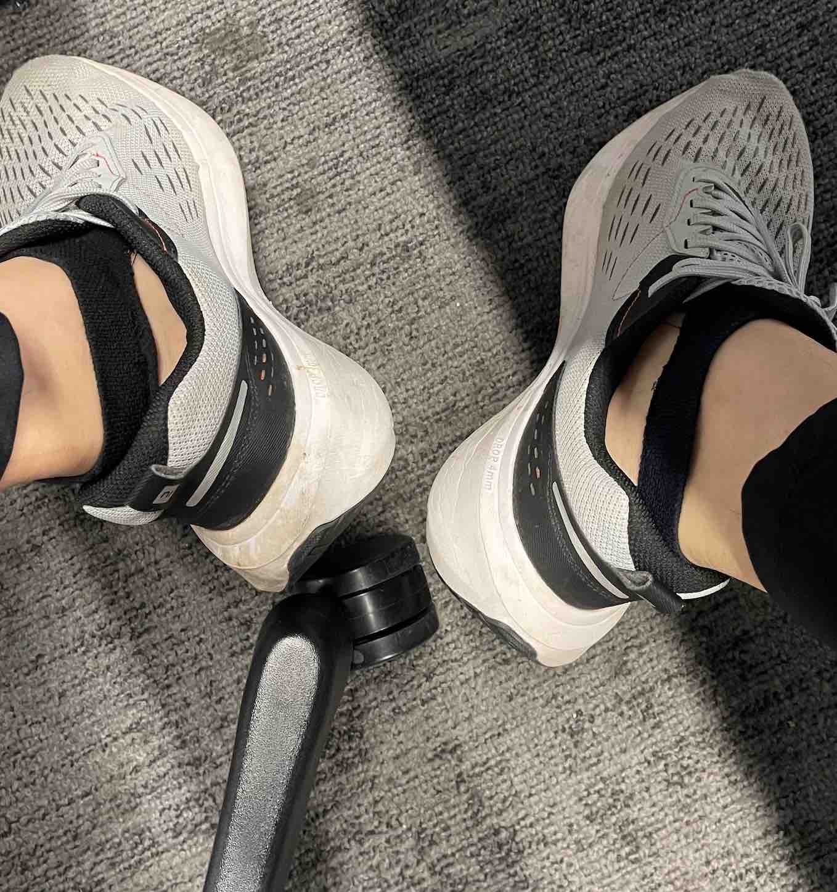

# 你知道袜子的"性感"穿法吗？

## 袜子上班记

８点了，又到出门上班的时间了。我依旧如平时一样，匆忙找来一双袜子，习惯性地往脚上一套，一提，３秒不到就可以搞定；然后双脚钻进鞋里，来不及扯上后跟，身体如离了弦的箭一般，直冲向电梯间。直到我的指尖按下电梯的按钮，我才松下一口气，弯下腰去做我未完成的事：拉鞋子后跟。**这已成为我上班常见的真实写照之一。**

你可能会问：“为什么如此着急，不能早点出门吗？”

可实际上，作为牛马的我，晚上下班较晚，睡觉也晚。所以早上怎么也睡不醒，醒了还要送娃去学校，分担些许家务，**更要命的是上班迟到要扣钱！**

可今天偏偏出了岔子，左脚袜子刚往脚上套好，我跟平常一样把袜子向上一提，只听“刺啦”一声脆响，袜子从脚后跟处裂开了。时间不等人，我也顾不了那么多；于是把右脚袜子也套好，向上一提，接着**又是一声刚听过的“刺啦”裂帛之响，清脆而让人惶恐**。右袜也从脚后跟处裂开，我的两个脚后跟也完全露了出来。我只能装做若无其事，乘着电梯下了楼，风风火火地上班去了。

想来是袜子穿得太久了，棉线纤维早就在日常磨损中悄悄老化变脆，今天终于禁不住我这"着急一提"。我又可以买一打新袜子了，嘿嘿！

也不错，我也算是蹭了回年轻人的潮流，过了把“破洞风”的瘾！不过我的破袜子更特别，似乎多了几分性感。只是**这多出的几分性感害得我小心翼翼**，走路时连步子都不敢迈太大，生怕裤脚往上缩，盖不住那双性感的袜子，而惹来路人好奇的目光——我有理由相信这绝对爆击“破洞牛仔裤”的回头率！

## 袜子趣闻

### 杨贵妃之袜——好挣钱

唐代藏书家冯贽在《记事珠》一书中记载：“杨贵妃死之日，马嵬媪得锦袎袜一只，遇过客一翫百钱，前后获钱无数。” 大意如下：

杨贵妃被害的当天，居住在马嵬驿附近的一个老太太，捡到了杨贵妃遗落的一只织锦高筒袜子。老太太很有经济头脑，她给沿途的过客观赏、把玩，每次收费一百钱，此后大发横财，获利无数。

### 圣诞袜的由来

相传圣诞老人是小亚细亚米拉古城的主教圣尼古拉斯的化身。他为人仁慈，乐善好施，生前做过很多好事。他死后，人们十分怀念他，把他称为爱护儿童之神。

据说，有一次他曾经偷偷把三袋金子送给一个穷人的三个女儿做嫁妆，**当他悄悄地把金子从烟囱口扔进去时，有一袋恰巧掉进晾在壁炉上的一只长筒袜子里**。于是在长统袜子中装进礼物送给儿童的习俗便流传下来了。直到今天，天真的孩子们还总是在圣诞节前夜郑重其事地把长筒袜挂在壁炉上，满怀希望地等待圣诞老人像传说中所讲的那样，从北方雪国乘坐八匹驯鹿拉的雪橇前来把礼物送给他们。

### 路易十四的丝绸长袜

法国国王路易十四是时尚的引领者，他偏爱穿着白色紧身的裤袜，据说他拥有超过 **1000** 双丝绸长袜，丝绸长袜也成为了当时皇室和上流社会的日常服饰之一。

### 爱因斯坦不穿袜子

著名科学家爱因斯坦以不修边幅著称，据说他从不穿袜子，因为他觉得穿袜子很麻烦。

### 迈克尔・杰克逊与白袜子

流行音乐之王迈克尔・杰克逊对白袜子情有独钟，他的经典舞步 “月球漫步” 搭配白袜子和黑皮鞋，成为了永恒的经典造型。